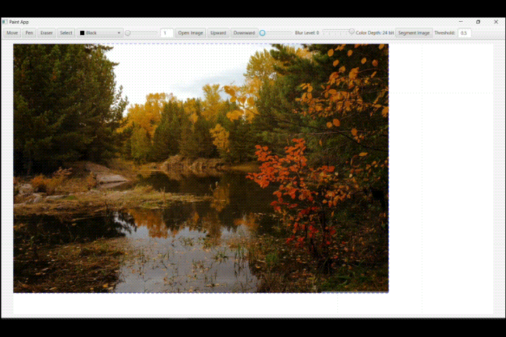
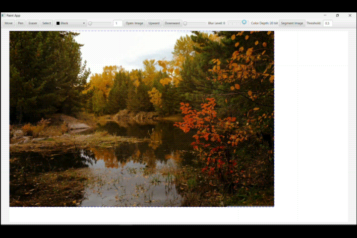
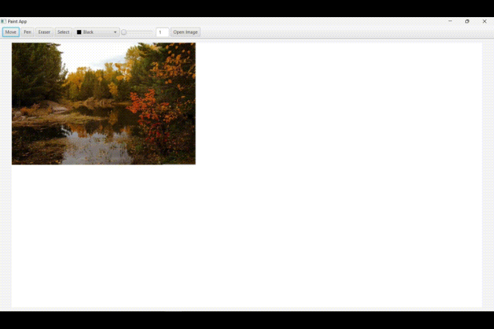
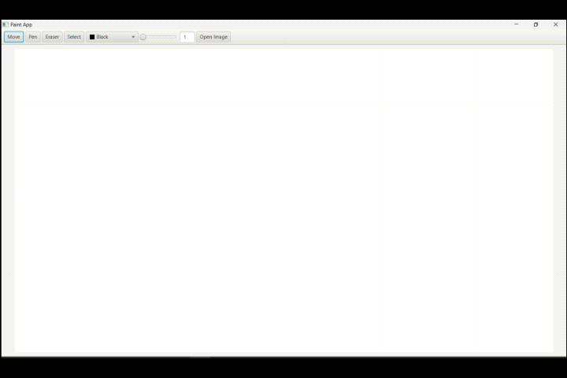

# STIMArt

## Daftar Isi

- [Deskripsi Aplikasi](#deskripsi-aplikasi)
- [Teknologi yang Digunakan](#teknologi-yang-digunakan)
- [Struktur Program](#struktur-program)
- [Penjelasan dan Penggunaan Algoritma](#penjelasan-dan-penggunaan-algoritma)
- [Cara Menjalankan Program](#cara-menjalankan-program)
- [Hasil Percobaan](#hasil-percobaan)
- [Referensi](#referensi)

## Deskripsi Aplikasi

STIMArt adalah sebuah aplikasi pemrosesan gambar yang dibuat dengan JavaFX. Aplikasi ini mencakup beberapa fitur dasar seperti **Move, Pen, Eraser, Select, dan Color Picking** serta fitur lanjutan seperti **Image Blurring, Color Depth Reducing, Image Segmentation, dan Undo Redo.** Pada aplikasi ini, pengguna juga bisa melakukan impor gambar dan menyimpan gambar yang telah dibuat.

## Teknologi yang Digunakan

- Java versi 22.0.1 atau lebih baru
- Maven
- JavaFX

## Struktur Program

```
.
├── mvnw
├── mvnw.cmd
├── out
│   └── artifacts
│       └── STIMArt_jar
├── pom.xml
├── readme.md
├── src
│   └── main
│       ├── java
│       │   ├── com
│       │   │   └── stimart
│       │   │       ├── App.java
│       │   │       ├── AppWrapper.java
│       │   │       ├── Class
│       │   │       │   ├── AppState.java
│       │   │       │   ├── ColorDepth.java
│       │   │       │   ├── ExternalImages.java
│       │   │       │   ├── ImageBlurring.java
│       │   │       │   ├── ImageSegmentation.java
│       │   │       │   ├── LineSegment.java
│       │   │       │   └── StateArray.java
│       │   │       └── Controller
│       │   │           └── PaintController.java
│       │   └── module-info.java
│       └── resources
│           ├── com
│           │   └── stimart
│           │       └── main-view.fxml
│           └── META-INF
│               └── MANIFEST.MF
├── STIMArt.jar
└── target
    ├── classes
    │   ├── com
    │   │   └── stimart
    │   │       ├── App.class
    │   │       ├── AppWrapper.class
    │   │       ├── Class
    │   │       │   ├── AppState.class
    │   │       │   ├── ColorDepth.class
    │   │       │   ├── ExternalImages.class
    │   │       │   ├── ImageBlurring.class
    │   │       │   ├── ImageSegmentation.class
    │   │       │   ├── LineSegment.class
    │   │       │   └── StateArray.class
    │   │       ├── Controller
    │   │       │   └── PaintController.class
    │   │       └── main-view.fxml
    │   ├── META-INF
    │   │   └── MANIFEST.MF
    │   └── module-info.class
    ├── generated-sources
    │   └── annotations
    └── test-classes
```

## Penjelasan dan Penggunaan Algoritma

1. Image Blurring  
Untuk fitur ini, pengembang menggunakan algoritma Divide and Conquer. Pengguna membagi gambar yang ingin dibuat blur menjadi empat kuadran yang sama besar, setelah itu warna masing-masing kuadran diganti dengan warna rata-ratanya. Proses pembuatan kuadran yang dilakukan akan semakin banyak seiring dengan rendahnya tingkat blur yang dipilih pengguna.
2. Color Depth Reducing  
Pengembang menggunakan algoritma Decrease and Conquer untuk fitur ini. Pengembang mengubah Color Depth dari setiap pixel pada gambar dan proses itu terus diulangi hingga seluruh pixel pada gambar telah berubah.
3. Image Segmentation  
Image Segmentation pada aplikasi ini menggunakan indikator pemisah berupa warna. Algoritma Branch and Bound digunakan untuk fitur ini. Dilakukan iterasi per pixel pada yang ingin disegmentasi. Setelah itu dilakukan perbandingan warna pada pixel gambar dengan warna yang dipilih pengguna. Kemudian pixel tersebut dipisahkan dengan gambar utama jika telah melewati threshold tertentu atau tetap berada pada gambar utama jika tidak melewati threshold tersebut.
4. Undo Redo  
Untuk fitur ini, digunakan algoritma Backtracking. Setiap pengguna melakukan sesuatu, akan disimpan state dari canvas tersebut. Kemudian jika pengguna melakukan Undo atau Redo, maka state yang aktif akan diganti berdasarkan data state yang telah disimpan.

## Cara Menjalankan Program

1. Pastikan sudah menginstall [Java versi 22.0.1 atau yang lebih baru](https://www.oracle.com/java/technologies/downloads/).
2. Buka `STIMArt.jar`

## Hasil Percobaan

- Image Blurring

- Color Depth Reducing

- Image Segmentation

- Undo Redo


## Referensi

- https://geeksforgeeks.org/
- https://docs.oracle.com/
- https://stackoverflow.com/